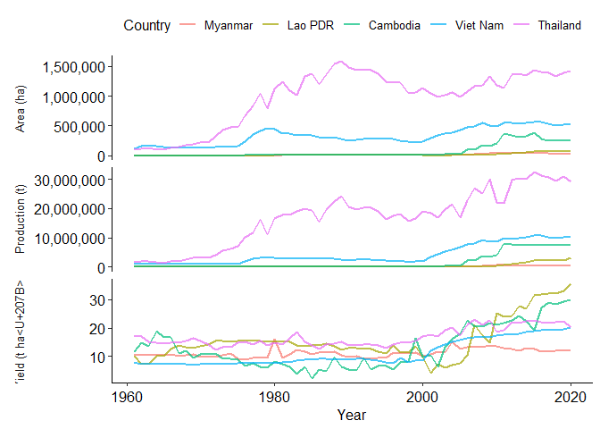
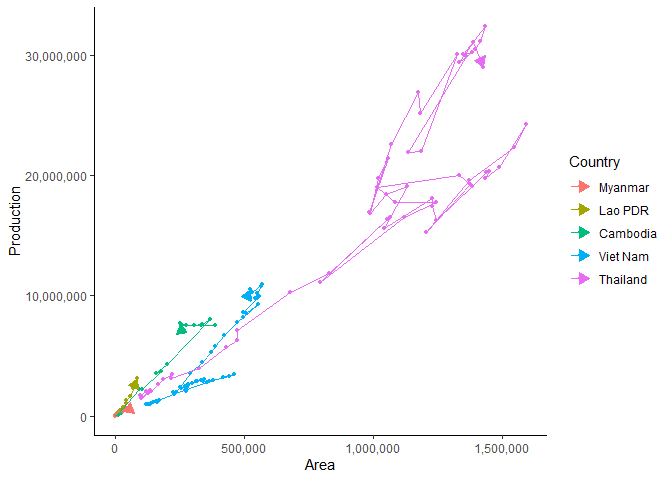
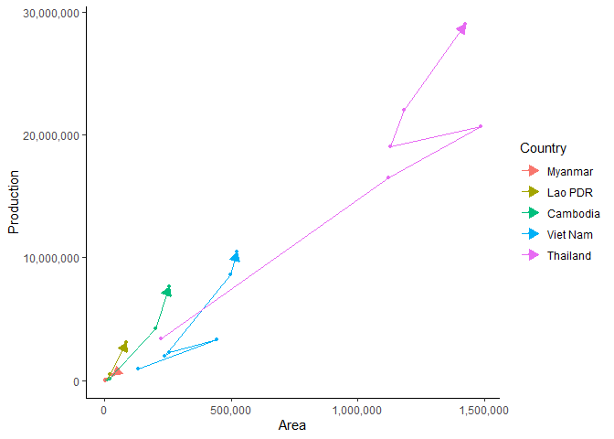
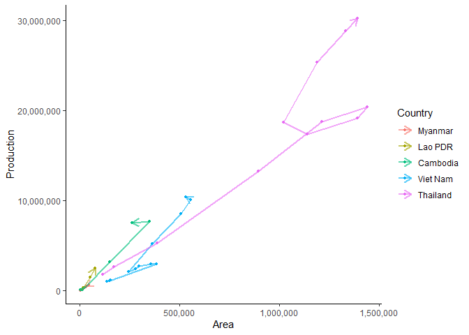
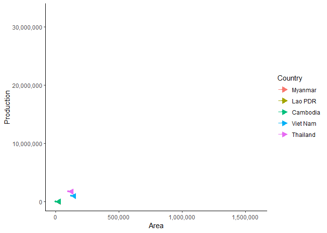
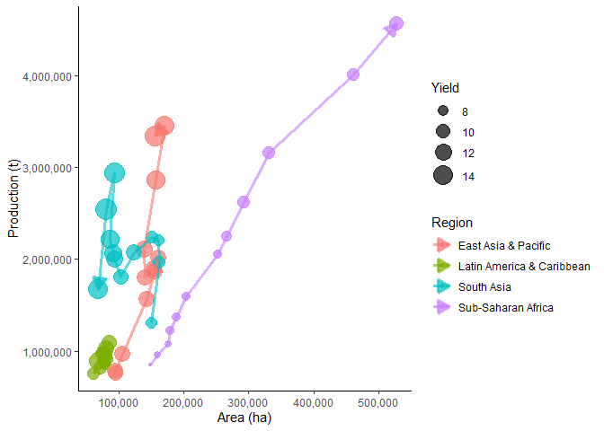
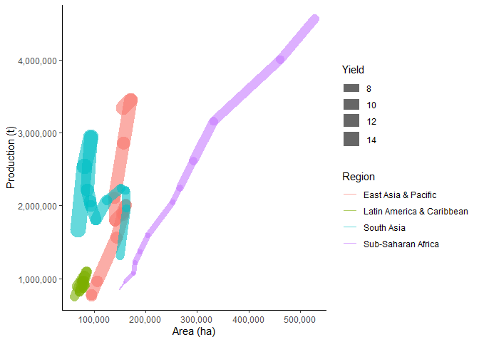

Line graphs and other explorations
================
Erik Delaquis
4/11/2022

``` r
library(tidyverse)
library(countrycode)
library(ggpubr)
```

First, we load the required data (see the basic script for origins)

``` r
#Copy the steps from the PLotly visualization file, but with a few tweaks
#The name will vary depending on the date of your download
FAO <- read.csv("data/FAOSTAT_data_4-8-2022.csv", header = TRUE)

#Subset data to remove the FAO-specific flags and columns we don't need
FAOF <-
  subset(FAO,
         select = c('Area', 'Area.Code..ISO3.', 'Element', 'Year', 'Value'))
FAOwide <- spread(FAOF, Element, Value) #long to wide
colnames(FAOwide)[1] <- "Country"
colnames(FAOwide)[4] <- "Area"

FAOwide$Yield <-
  as.numeric(as.character(FAOwide$Yield)) / 10000 #Convert from hg/ha to T/ha

FAOwide$continent <-
  countrycode(sourcevar = FAOwide[, "Area.Code..ISO3."],
              origin = "iso3c",
              destination = "continent")

FAOwide$region <-
  countrycode(sourcevar = FAOwide[, "Area.Code..ISO3."],
              origin = "iso3c",
              destination = "region")

#We now have both continent and region label columns in our dataset
#Let's replace NAs with 0
FAOwide$Area <- FAOwide$Area %>%  replace_na(0)
FAOwide$Production <- FAOwide$Production %>%  replace_na(0)
FAOwide$Yield <- FAOwide$Yield %>%  replace_na(0)

#This introduces some weird cases in which there is 0 under Area and Yield but some small number like 1 or 2 under Production.
#My guess is that this arises when the area is less than 1 ha - FAOstat rounds it to a 0, introducing NAs in calculation.
#We don't really care about such small numbers since we're taking a global approach, so we'll leave them as 0 for now.

unique(FAOwide$Country) #Check country names
```

    ##   [1] "Angola"                             "Antigua and Barbuda"               
    ##   [3] "Argentina"                          "Bahamas"                           
    ##   [5] "Barbados"                           "Belize"                            
    ##   [7] "Benin"                              "Bolivia (Plurinational State of)"  
    ##   [9] "Brazil"                             "Brunei Darussalam"                 
    ##  [11] "Burkina Faso"                       "Burundi"                           
    ##  [13] "Côte d'Ivoire"                     "Cabo Verde"                        
    ##  [15] "Cambodia"                           "Cameroon"                          
    ##  [17] "Central African Republic"           "Chad"                              
    ##  [19] "China"                              "China, mainland"                   
    ##  [21] "China, Taiwan Province of"          "Colombia"                          
    ##  [23] "Comoros"                            "Congo"                             
    ##  [25] "Cook Islands"                       "Costa Rica"                        
    ##  [27] "Cuba"                               "Democratic Republic of the Congo"  
    ##  [29] "Dominica"                           "Dominican Republic"                
    ##  [31] "Ecuador"                            "El Salvador"                       
    ##  [33] "Equatorial Guinea"                  "Fiji"                              
    ##  [35] "French Guyana"                      "French Polynesia"                  
    ##  [37] "Gabon"                              "Gambia"                            
    ##  [39] "Ghana"                              "Grenada"                           
    ##  [41] "Guadeloupe"                         "Guatemala"                         
    ##  [43] "Guinea"                             "Guinea-Bissau"                     
    ##  [45] "Guyana"                             "Haiti"                             
    ##  [47] "Honduras"                           "India"                             
    ##  [49] "Indonesia"                          "Jamaica"                           
    ##  [51] "Kenya"                              "Lao People's Democratic Republic"  
    ##  [53] "Liberia"                            "Madagascar"                        
    ##  [55] "Malawi"                             "Malaysia"                          
    ##  [57] "Maldives"                           "Mali"                              
    ##  [59] "Martinique"                         "Mauritius"                         
    ##  [61] "Mexico"                             "Micronesia (Federated States of)"  
    ##  [63] "Mozambique"                         "Myanmar"                           
    ##  [65] "New Caledonia"                      "Nicaragua"                         
    ##  [67] "Niger"                              "Nigeria"                           
    ##  [69] "Niue"                               "Panama"                            
    ##  [71] "Papua New Guinea"                   "Paraguay"                          
    ##  [73] "Peru"                               "Philippines"                       
    ##  [75] "Puerto Rico"                        "Qatar"                             
    ##  [77] "Réunion"                           "Rwanda"                            
    ##  [79] "Saint Lucia"                        "Saint Vincent and the Grenadines"  
    ##  [81] "Samoa"                              "Sao Tome and Principe"             
    ##  [83] "Senegal"                            "Seychelles"                        
    ##  [85] "Sierra Leone"                       "Singapore"                         
    ##  [87] "Solomon Islands"                    "Somalia"                           
    ##  [89] "South Sudan"                        "Sri Lanka"                         
    ##  [91] "Sudan"                              "Sudan (former)"                    
    ##  [93] "Suriname"                           "Thailand"                          
    ##  [95] "Timor-Leste"                        "Togo"                              
    ##  [97] "Tonga"                              "Trinidad and Tobago"               
    ##  [99] "Uganda"                             "United Republic of Tanzania"       
    ## [101] "Venezuela (Bolivarian Republic of)" "Viet Nam"                          
    ## [103] "Zambia"                             "Zimbabwe"

``` r
apply(FAOwide, 2, function(x)
  any(is.na(x))) #Check for the presence of NAs by column
```

    ##          Country Area.Code..ISO3.             Year             Area 
    ##            FALSE            FALSE            FALSE            FALSE 
    ##       Production            Yield        continent           region 
    ##            FALSE            FALSE             TRUE             TRUE

``` r
#No more NAs in our data columns, but there is some in the continent and country

#FAO likes to report both 'China' and 'China, mainland'. Let's remove that redundancy.
FAOwide <- FAOwide %>% filter(Country != "China")

#China, mainland lacks both 'continent' and 'region' entries - we can fix that.
FAOwide <- FAOwide %>%
  mutate(continent = ifelse(Country == 'China, mainland', 'Asia', continent)) %>% mutate(region =
                                                                                           ifelse(Country == 'China, mainland', 'East Asia & Pacific', region))

#The entry for Sudan lacks both continent and region.
FAOwide <- FAOwide %>%
  mutate(continent = ifelse(Country == 'Sudan (former)', 'Africa', continent)) %>% mutate(region =
                                                                                            ifelse(Country == 'Sudan (former)', 'Sub-Saharan Africa', region))

#Reunion has missing region, but the accents have messed up the name, so let's use the ISO code
FAOwide <- FAOwide %>%
  mutate(region = ifelse(Area.Code..ISO3. == 'REU', 'Sub-Saharan Africa', region))

#The messed up names for Réunion and Côte d'Ivoire are due to translation of the special characters. We'll just substitute the appropriate accents in.
FAOwide <- FAOwide %>%
  mutate(Country = ifelse(Area.Code..ISO3. == 'REU', 'Réunion', Country)) %>%
  mutate(Country = ifelse(Area.Code..ISO3. == 'CIV', "Côte d'Ivoire", Country))

#Finally, because we are using Lao People's Democratic Republic a lot, let's shorten the name to Lao PDR
FAOwide<- FAOwide %>% mutate(Country=recode(Country, "Lao People's Democratic Republic" = "Lao PDR"))
```

Now we can make visualizations. Let’s start with an area graph for GMS

``` r
GMS <-
  FAOwide %>% filter(Area.Code..ISO3. %in% c('KHM', 'VNM', 'THA', 'MMR', 'LAO'))
GMS$Country <-
  factor(
    GMS$Country,
    levels = c(
      "Myanmar",
      "Lao PDR",
      "Cambodia",
      "Viet Nam",
      "Thailand"
    )
  ) #manually reorder smallest to biggest

ggplot(data = GMS, aes(x = Year, y = Area, group = Country)) +
  geom_area(aes(color = Country, fill = Country)) +
  scale_y_continuous(labels = scales::comma) +
  labs(y = "Area (ha)") +
  theme_pubr() +
  theme(legend.position = "bottom")
```

<!-- -->

If we want to make line graphs of the three measures, in my opinion the
easiest method is by pivoting back to long format and making use of the
faceting function of ggplot2.

``` r
#First we use pivot_longer to create a grouped column storing all our 3 numeric variables 'element', and put the corresponding values in a column named 'value'
GMSL <- GMS %>% pivot_longer(
  cols = c(Area, Yield, Production),
  names_to = "element",
  values_to = "value"
)

#New strip/facet labels
Axis_labs <- c(`Area` = "Area (ha)",
                    `Production` = "Production (t)",
                    `Yield` = "Yield (t ha⁻¹)")

#function to apply the labels to the plot - we will call it in the 'labeller'
Axis_labeller <- function(variable,value){
  return(Axis_labs[value])
}

ggplot(GMSL , aes(x = Year, y = value, group = Country)) +
  geom_line(aes(colour = Country), size=1, alpha=0.7) +
  facet_grid(rows = "element",
             scales = "free",
             switch = 'y',
             labeller = as_labeller(Axis_labeller)) + #Facet the grid by the new group column we created containing our 3 numeric variables
  scale_y_continuous(labels = scales::comma) + #Format y scale using thousands separators
  theme_pubr() + #From ggpubr, with sensible publication defaults
  theme(axis.title.y = element_blank(), 
        strip.placement = "outside",
        strip.background = element_blank(),
        panel.border = element_blank())
```

<!-- -->

We can also plot the progression over time, using paths

``` r
library(tidyquant)

GMS %>% 
  ggplot(aes(x=Area, y=Production, group=Country)) + 
  geom_point(aes(colour=Country), size=1)+
  geom_path(arrow = arrow(type="closed", length = unit(0.3, "cm")), aes(colour=Country)) +
  scale_y_continuous(labels = scales::comma) +
  scale_x_continuous(labels = scales::comma) +
  theme_classic()
```

<!-- -->

``` r
 # geom_ma(ma_fun = SMA, n=3)
```

Manually specifying 10 year increments

``` r
GMS %>% filter(Year==1960 | Year==1970 | Year==1980 | Year==1990 | Year == 2000 | Year==2010 | Year==2020) %>% 
  ggplot(aes(x=Area, y=Production, group=Country)) + 
  geom_point(aes(colour=Country), size=1)+
  geom_path(arrow = arrow(type="closed", length = unit(0.3, "cm")), aes(colour=Country)) +
  scale_y_continuous(labels = scales::comma) +
  scale_x_continuous(labels = scales::comma) +
  theme_classic()
```

<!-- -->

``` r
 # geom_ma(ma_fun = SMA, n=3)
```

Let’s try automatically slicing 5 year increment averages to smooth
things out

``` r
GMS %>% group_by(Country, Year=ceiling(Year/5)*5) %>% 
  summarize(Year=paste(first(Year)-5, first(Year), sep='-'),
            Area=mean(Area), Production=mean(Production), Yield=mean(Yield)) %>% 
  ggplot(aes(x=Area, y=Production, group=Country)) + 
  geom_point(aes(colour=Country), size=1)+
  geom_path(arrow = arrow(length = unit(0.3, "cm")), aes(colour=Country), size=1, alpha=.6) +
  scale_y_continuous(labels = scales::comma) +
  scale_x_continuous(labels = scales::comma) +
  theme_classic()
```

<!-- -->

We can animate the paths using gganimate -this will give us a .gif that
can be inserted into powerpoints, etc.

``` r
library(gganimate)
```

    ## Warning: package 'gganimate' was built under R version 4.0.5

``` r
GMS %>% 
  ggplot(aes(x=Area, y=Production, group=Country)) + 
  geom_point(aes(colour=Country), size=1)+
  geom_path(arrow = arrow(type="closed", length = unit(0.3, "cm")), aes(colour=Country)) +
  scale_y_continuous(labels = scales::comma) +
  scale_x_continuous(labels = scales::comma) +
  theme_classic()+
  transition_reveal(Year)
```

<!-- -->

Feeling nasty. Why don’t we do it for the whole planet and see where we
end up? This time we’ll divide into 5-year increments by region.

``` r
FAOwide %>% filter(region != "Middle East & North Africa") %>% group_by(region, Year=ceiling(Year/5)*5) %>% 
  summarize(Year=paste(first(Year)-5, first(Year), sep='-'),
            Area=mean(Area), Production=mean(Production), Yield=mean(Yield)) %>% 
  ggplot(aes(x=Area, y=Production, group=region)) + 
  geom_point(aes(colour=region, size=Yield), alpha=0.7)+
  scale_size_continuous(range = c(1,8)) +
  geom_path(arrow = arrow(type="closed", length = unit(0.4, "cm")), aes(colour=region), size=1.1, alpha=.6) +
  scale_y_continuous(labels = scales::comma) +
  scale_x_continuous(labels = scales::comma) +
  theme_classic() +
  theme() +
  labs(x="Area (ha)", y="Production (t)", colour="Region") +
  geom_text(data = subset(FAOwide, Year=="1960-1965" | Year=="2015-2020"), aes(label=Year))
```

<!-- -->

What if we want to vary the line (geom\_path) width instead?

``` r
FAOwide %>% filter(region != "Middle East & North Africa") %>% group_by(region, Year=ceiling(Year/5)*5) %>% 
  summarize(Year=paste(first(Year)-5, first(Year), sep='-'),
            Area=mean(Area), Production=mean(Production), Yield=mean(Yield)) %>% 
  ggplot(aes(x=Area, y=Production, group=region)) +
  scale_size_continuous(range = c(1,8)) +
  geom_path(aes(colour=region, size=Yield), alpha=.6, lineend = "round") +
  scale_y_continuous(labels = scales::comma) +
  scale_x_continuous(labels = scales::comma) +
  theme_classic() +
  theme() +
  labs(x="Area (ha)", y="Production (t)", colour="Region") +
  geom_text(data = subset(FAOwide, Year=="1960-1965" | Year=="2015-2020"), aes(label=Year))
```

<!-- -->

We can even go into 3 dimensions by using Plotly and adding Yield

``` r
library(plotly)
plot_ly(GMS, x = ~Area, y = ~Production, z = ~Yield) %>%
  add_paths(color = ~Country)
```

<!-- -->
