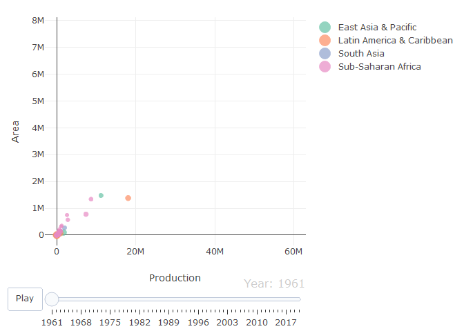
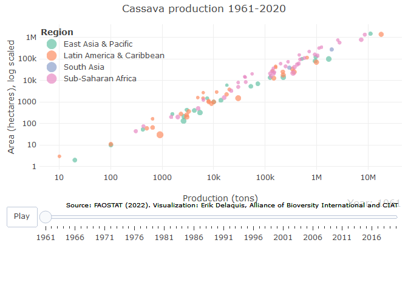

FAOSTAT visualization with Plotly
================
Erik Delaquis
4/9/2022

# Making animated and interactive graphs from FAOSTAT data

## Data download and processing

As far as I can tell, FAO still stubbornly refuses to provide an API to
allow us to pull data directly. This is only a minor inconvenience since
downloading data from the site in standard format is pretty easy and
could be automated. For this example I will just be using a
manually-downloaded version of the data generated in .csv format by
going to the [FAOSTAT
website](https://www.fao.org/faostat/en/#data/QCL).

I am going to do this for global cassava production as an example - it
can be replicated with any (or multiple) crops.

-   Select all countries - to make a later step easier, click the gear
    and choose ISO3 for country identifiers.

-   Check the boxes for Area harvested, yield, production/quantity

-   Under items, select cassava.

-   Years - all available (goes back to 1961)

-   Click ‘download data’

This will put a .csv file containing the data in long format in your
downloads folder. Now, to make our plot.

First, load in the required packages:

``` r
### Load in packages ####
library(tidyverse)
library(ggplot2)
library(plotly)
library(gapminder)
library(countrycode)
```

Now read in the downloaded .csv file you downloaded. The name will vary
depending on the date of your download. After reading in the data, we
are going to check it out, add a few elements of use for our plotting,
and clean up.

``` r
#read in .csv
FAO <- read.csv("data/FAOSTAT_data_4-8-2022.csv", header = TRUE)

#Subset data to remove the FAO-specific flags and columns we don't need
FAOF <-
  subset(FAO,
         select = c('Area', 'Area.Code..ISO3.', 'Element', 'Year', 'Value'))

#How many individual 'countries' are in this dataset?
FAOF %>% summarise(Unique_Elements = n_distinct(Area))
```

    ##   Unique_Elements
    ## 1             104

``` r
#So 104 countries have reported growing cassava (as of 2022) - impressive

#Go from long to wide with tidyr for ease of plotting; change column name of 'Area' to 'Country'
#Notice we use Element and Value in the spread argument
FAOwide <- spread(FAOF, Element, Value)
colnames(FAOwide)[1] <- "Country"
colnames(FAOwide)[4] <- "Area"

#Yield is expressed by FAO as hectograms per hectare (100g/ha), so must always convert to T/ha FAOwide$Yield <- as.numeric(as.character(FAOwide$Yield)) / 10000

head(FAOwide) #Let's check it out
```

    ##   Country Area.Code..ISO3. Year   Area Production Yield
    ## 1  Angola              AGO 1961 350000    1250000 35714
    ## 2  Angola              AGO 1962 400000    1275000 31875
    ## 3  Angola              AGO 1963 400000    1300000 32500
    ## 4  Angola              AGO 1964 400000    1320000 33000
    ## 5  Angola              AGO 1965 420000    1400000 33333
    ## 6  Angola              AGO 1966 450000    1500000 33333

That looks fine - we have our countries, ISO3 code, year, and the three
variables we were interested in. But we want one more thing -
continent/region. This will help us to color code our points for easy
reference later.

This is why we got the ISO3 code - a standard code we can use for this
purpose. We will use the countrycode package to do this. Let’s add the
World Bank ‘continent’ and ‘region’ designations using the countrycode
package

    ## Warning in countrycode_convert(sourcevar = sourcevar, origin = origin, destination = dest, : Some values were not matched unambiguously: 206, 41

    ## Warning in countrycode_convert(sourcevar = sourcevar, origin = origin, destination = dest, : Some values were not matched unambiguously: 206, 41, REU

    ##   [1] "Angola"                             "Antigua and Barbuda"               
    ##   [3] "Argentina"                          "Bahamas"                           
    ##   [5] "Barbados"                           "Belize"                            
    ##   [7] "Benin"                              "Bolivia (Plurinational State of)"  
    ##   [9] "Brazil"                             "Brunei Darussalam"                 
    ##  [11] "Burkina Faso"                       "Burundi"                           
    ##  [13] "Côte d'Ivoire"                     "Cabo Verde"                        
    ##  [15] "Cambodia"                           "Cameroon"                          
    ##  [17] "Central African Republic"           "Chad"                              
    ##  [19] "China"                              "China, mainland"                   
    ##  [21] "China, Taiwan Province of"          "Colombia"                          
    ##  [23] "Comoros"                            "Congo"                             
    ##  [25] "Cook Islands"                       "Costa Rica"                        
    ##  [27] "Cuba"                               "Democratic Republic of the Congo"  
    ##  [29] "Dominica"                           "Dominican Republic"                
    ##  [31] "Ecuador"                            "El Salvador"                       
    ##  [33] "Equatorial Guinea"                  "Fiji"                              
    ##  [35] "French Guyana"                      "French Polynesia"                  
    ##  [37] "Gabon"                              "Gambia"                            
    ##  [39] "Ghana"                              "Grenada"                           
    ##  [41] "Guadeloupe"                         "Guatemala"                         
    ##  [43] "Guinea"                             "Guinea-Bissau"                     
    ##  [45] "Guyana"                             "Haiti"                             
    ##  [47] "Honduras"                           "India"                             
    ##  [49] "Indonesia"                          "Jamaica"                           
    ##  [51] "Kenya"                              "Lao People's Democratic Republic"  
    ##  [53] "Liberia"                            "Madagascar"                        
    ##  [55] "Malawi"                             "Malaysia"                          
    ##  [57] "Maldives"                           "Mali"                              
    ##  [59] "Martinique"                         "Mauritius"                         
    ##  [61] "Mexico"                             "Micronesia (Federated States of)"  
    ##  [63] "Mozambique"                         "Myanmar"                           
    ##  [65] "New Caledonia"                      "Nicaragua"                         
    ##  [67] "Niger"                              "Nigeria"                           
    ##  [69] "Niue"                               "Panama"                            
    ##  [71] "Papua New Guinea"                   "Paraguay"                          
    ##  [73] "Peru"                               "Philippines"                       
    ##  [75] "Puerto Rico"                        "Réunion"                          
    ##  [77] "Rwanda"                             "Saint Lucia"                       
    ##  [79] "Saint Vincent and the Grenadines"   "Samoa"                             
    ##  [81] "Sao Tome and Principe"              "Senegal"                           
    ##  [83] "Seychelles"                         "Sierra Leone"                      
    ##  [85] "Singapore"                          "Solomon Islands"                   
    ##  [87] "Somalia"                            "South Sudan"                       
    ##  [89] "Sri Lanka"                          "Sudan (former)"                    
    ##  [91] "Suriname"                           "Thailand"                          
    ##  [93] "Timor-Leste"                        "Togo"                              
    ##  [95] "Tonga"                              "Trinidad and Tobago"               
    ##  [97] "Uganda"                             "United Republic of Tanzania"       
    ##  [99] "Venezuela (Bolivarian Republic of)" "Viet Nam"                          
    ## [101] "Zambia"                             "Zimbabwe"

    ##          Country Area.Code..ISO3.             Year             Area 
    ##            FALSE            FALSE            FALSE            FALSE 
    ##       Production            Yield        continent           region 
    ##            FALSE             TRUE             TRUE             TRUE

So looks like we have a bit of cleaning to do. Here are a few
step-by-step instructions to clear up our issues.

``` r
#FAO likes to report both 'China' and 'China, mainland'. Let's remove that redundancy.
FAOwide <- FAOwide %>% filter(Country != "China")

#China, mainland lacks both 'continent' and 'region' entries - we can fix that.
FAOwide <-
  FAOwide %>% mutate(continent = ifelse(Country == 'China, mainland', 'Asia', continent)) %>% mutate(region = ifelse(Country == 'China, mainland', 'East Asia & Pacific', region))

#The entry for Sudan lacks both continent and region.
FAOwide <-
  FAOwide %>% mutate(continent = ifelse(Country == 'Sudan (former)', 'Africa', continent)) %>% mutate(region = ifelse(Country == 'Sudan (former)', 'Sub-Saharan Africa', region))

#Reunion has missing region, but the accents have messed up the name, so let's use the ISO code
FAOwide <-
  FAOwide %>% mutate(region = ifelse(Area.Code..ISO3. == 'REU', 'Sub-Saharan Africa', region))

#The messed up names for Réunion and Côte d'Ivoire are due to translation of the special characters. We'll just substitute the appropriate accents in.
FAOwide <-
  FAOwide %>% mutate(Country = ifelse(Area.Code..ISO3. == 'REU', 'Réunion', Country)) %>% mutate(Country = ifelse(Area.Code..ISO3. == 'CIV', "Côte d'Ivoire", Country))

head(FAOwide)
```

    ##   Country Area.Code..ISO3. Year   Area Production Yield continent
    ## 1  Angola              AGO 1961 350000    1250000 35714    Africa
    ## 2  Angola              AGO 1962 400000    1275000 31875    Africa
    ## 3  Angola              AGO 1963 400000    1300000 32500    Africa
    ## 4  Angola              AGO 1964 400000    1320000 33000    Africa
    ## 5  Angola              AGO 1965 420000    1400000 33333    Africa
    ## 6  Angola              AGO 1966 450000    1500000 33333    Africa
    ##               region
    ## 1 Sub-Saharan Africa
    ## 2 Sub-Saharan Africa
    ## 3 Sub-Saharan Africa
    ## 4 Sub-Saharan Africa
    ## 5 Sub-Saharan Africa
    ## 6 Sub-Saharan Africa

Ok, our data looks clean. Time to work on generation of the plots
themselves.

## Plotly + Gapminder… so easy

Using the Plotly library requires learning some new syntax if you’re
used to ggplot, but it’s pretty straightforward. Plotly plays friendly
with pipes, which simplifies things a lot. The Gapminder package, based
on the famous Hans Rosling style, makes these styles of animations very
simple. There are some other handy features on by default, including
autoscaling of the plot size in browser.

``` r
#Basic plot
interactive_area_production <-
  FAOwide %>% plot_ly(
    x = ~ Production,
    y = ~ Area,
    size = ~ Yield,
    color = ~ region,
    frame = ~ Year,
    text = ~ Country,
    hoverinfo = "text",
    type = 'scatter',
    mode = 'markers'
  )
interactive_area_production
```

<!-- -->

With the Plotly library, pipes can be used to customize the basic plot
fairly easily. Adding elasticity to animation (and turn off redraw which
looks janky), and log transform the y axis. Manually specifying axis
labels, title, and legend title.

``` r
interactive_area_production <- interactive_area_production %>%
  layout(yaxis = list(type = "log"), xaxis = list(type = "log")) %>% animation_opts(500, easing = "elastic", redraw = FALSE) %>% #the 500 calibrates time between steps in the animation: less=shorter
  layout(
    title = 'Cassava production 1961-2020',
    plot_bgcolor = "rgba(0, 0, 0, 0)",
    #This means transparent
    xaxis = list(title = 'Production (tons)'),
    yaxis = list(title = 'Area (hectares), log scaled'),
    legend = list(
      x = 0,
      y = 1,
      title = list(text = '<b> Region </b>'),
      bgcolor = 'rgba(0,0,0,0)'
    ),
    margin = list(b = 200, t = 40, pad = 4)
  ) %>%
  layout(
    annotations = list(
      x = 1,
      y = -0.275,
      text = "Source: FAOSTAT (2022). Visualization: Erik Delaquis, Alliance of Bioversity International and CIAT",
      showarrow = F,
      xref = 'paper',
      yref = 'paper',
      xanchor = 'right',
      yanchor = 'auto',
      xshift = 0,
      yshift = 0,
      font = list(size = 10,
                  color = "black")
    )
  )

interactive_area_production
```

<!-- -->

## Custom function for checking html widget file size

``` r
widget_file_size <- function(p) {
  d <- tempdir()
  withr::with_dir(d, htmlwidgets::saveWidget(p, "index.html"))
  f <- file.path(d, "index.html")
  mb <- round(file.info(f)$size / 1e6, 3)
  message("File is: ", mb, " MB")
}

#Use the new function to check file size
widget_file_size(interactive_area_production) #File size is 5.561 MB
```

Save the widget as html

``` r
htmlwidgets::saveWidget(interactive_area_production, "outputs/FAO_inter.html")
```

## Partial bundle function reduces size of html by only keeping the dependencies we need for our particular animation

``` r
interactive_area_production_reduced <- partial_bundle(interactive_area_production) 

widget_file_size(interactive_area_production_reduced) #File size is 2.11 MB
```

``` r
#Save the reduced version under a modified name
htmlwidgets::saveWidget(interactive_area_production_reduced, "outputs/FAO_inter_reduce.html")
```
